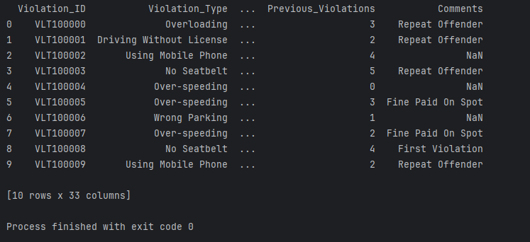
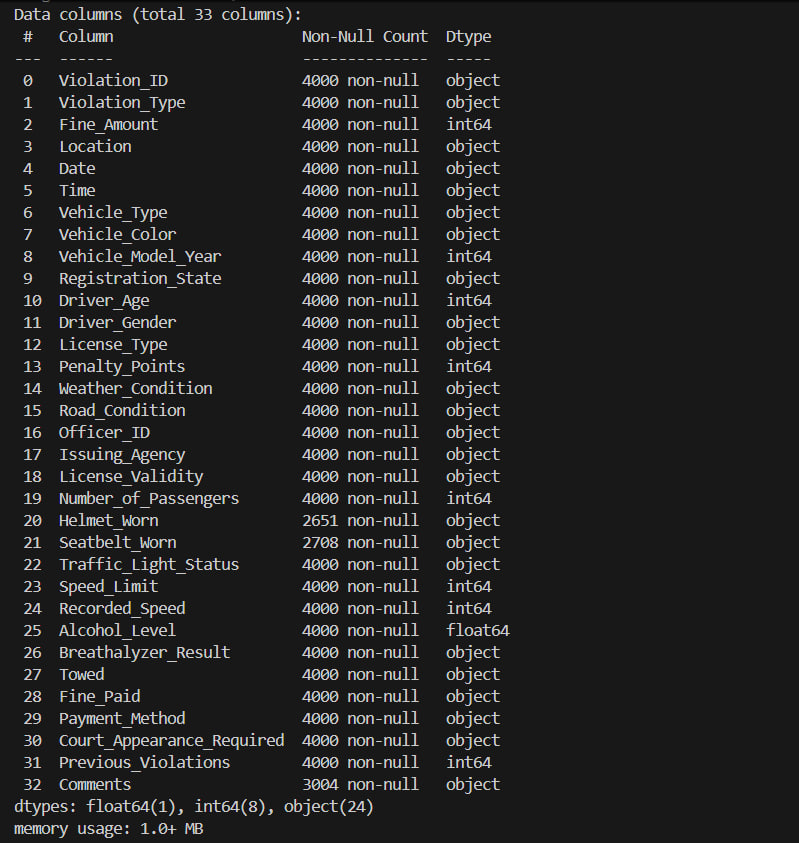
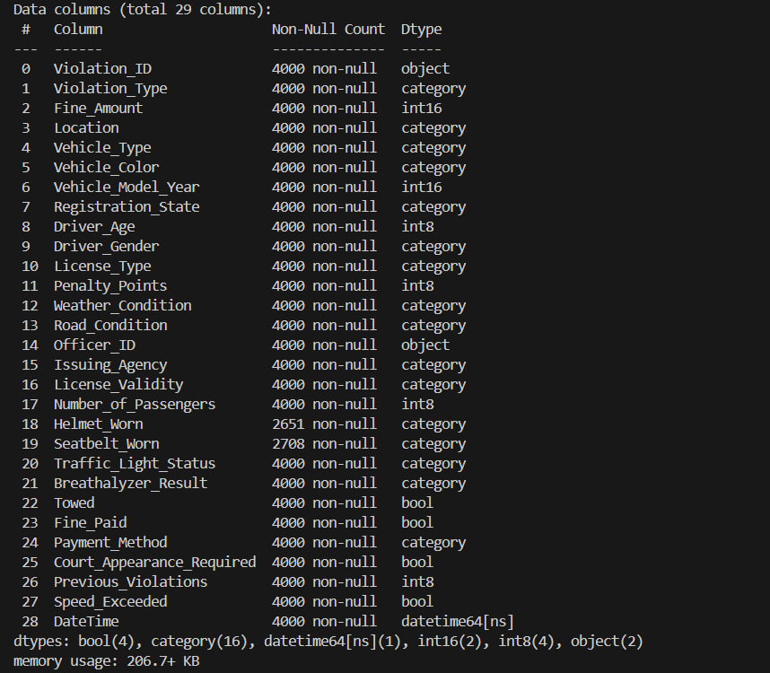

# Project in Data Engineering ITMO 2025
<div id="header" align="left">
  
</div>

## О проекте
  Проект реализован в рамках дисциплины по Инжинирингу данных на языке Python. Его целью является знакомство с основами инжиниринга, c разработкой программ по обработке больших баз данных и визуализации полученных результатов.

## Датасет
  Обрабатывается набор данных о нарушениях правил дорожного движения в разных штатах Индии за 2023 и 2024 год.
  
Ссылка на веб-источник: https://www.kaggle.com/datasets/khushikyad001/indian-traffic-violation/data

Ссылка на сохранённый датасет: https://drive.google.com/file/d/1gJrXyvqIVSZCEjqhGhvisyMyxI0zBald/view?usp=drive_link


# Руководство по чтению датасета

## Требования
  - Conda >= 25.7.0
  - Python >= 3.12.3
  - Poetry >= 2.2.0
  - pip

## Установка Conda+Poetry, создание переменного окружения
  > [!IMPORTANT]
  > Для работы со скриптом, необходимо скачать и поместить в пустую папку 3 файла: environment.yml, pyproject.toml и poetry.lock, установить miniconda (убедитесь, что есть в PATH) и poetry. Выполнить шаги 2 и 7

1. Создать переменное окружение
```
cоnda env create -f environment.yml
```
2. Активировать переменное окружение
```
cоnda activate <название окружения из environment.yml>
```
3. Инициализировать Poetry
```
poetry init
```
4. Определить Poetry в виртуальное окружение Сonda
```
poetry config virtualenvs.create false
```
5. Добавить зависимости в проект
```
poetry add jupyterlab pandas matplotlib wget
```
6. Установить Poetry
```
poetry install
```
> [!TIP]
> При работе в VSCode необходимо выбрать переменное окружение через "Python: Select Interpreter"

7. Активировать скрипт
```
python3 data_loader.py
```
  Результат работы скрипта:


# Приведение типов данных и сохранение датасета в формате .parquet.

> [!TIP]
> Для удобства предварительного анализа данных из датасета и совершенствования кода были созданы файл-ноутбук .ipynb и data_loader_test.py в папке "tests". Для работы с ноутбуком необходимо установить kernel

При работе с базой данных важно, чтобы данные не попадали в репозиторий на github. Решение этой задачи было реализовано в tests/data_loader_test.py и перенесено в основной файл с кодом data_loader.py.

## Анализ типов данных
Исследование данных проводилось с целью выявления ошибочных данных, пустых значений (NaN) и типов данных в файле data_loader_test.py, решение перенесено в основной файл data_processing.py.
Была создана копия (маска), в которой на основании анализа проведены замена данных и изменение типов.
У выбранного датасета 33 признака. Данные до обработки выводятся таблицей при помощи команды:
```
print(raw_data.info())
```


## Приведение типов данных и исправление значений
Были проведены следующие действия:
1. Определение количества пустых значений, уникальных значений и их перечисление
2. Исправление ошибок, например, изменение категории NaN на "not_required" для сохранения логики
3. Объединение признаков для оптимизации памяти (например, признак DateTime) и удаление исходных
4. Замена типа данных с помощью команды:
```
<переменная>["<название признака>"].astype("<новый тип данных>")
```
Таким образом, в процессе обработки было уменьшено использование памяти:


## Сохранение датасета в формате .parquet

> [!TIP]
> Для работы с Parquet необходимо установить библиотеку pyarrow

В файле-исполнителе программы - main_project.py - вызываются функции по загрузке и обработке данных, предварительно указываются пути и происходит проверка наличия файлов .parquet и .csv.
Сохранение обработанных данных производится командой:
'''
proc_data.to_parquet(parquet_path, index=False)
'''
Этот файл будет использоваться при дальнейшей работе и анализе.
